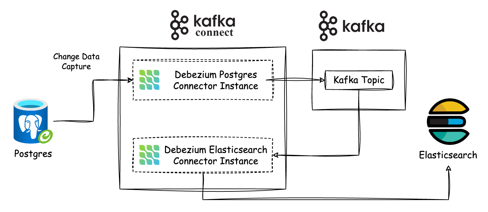

# Crawler Demo for DevOps

In this project, we will set up the CI/CD and infrastructure for the crawler systems below on Kubernetes.

## Overview System

### Crawler System: crawler posts + redis stream + consumer

### Change Data Capture System: Postgres + Kafka Connect + Elasticsearch

### API Service: Rust + Postgres + Elasticsearch

<!-- Crawler: read url writer to Redis -->
<!-- Consumer: sub and receive message from Redis to save to DB -->

# Steps

## 1 Run Crawler Application

`docker compose up -d`

## 2 Run Database

`cd migrate`

## 3 Run Migration

`go get` \
`go run main.go tables.go init` \
`go run main.go tables.go 25012024_posts.go migrate`

<!-- Errors: check volumes: delete add local and docker -->

## 4 Run Crawler Service

`cd crawler` \
`go run main.go`

<!-- Connect to Redis: use Another Redis -->

## 5 Run Consumer Service

`cd consumer` \
`go run main.go tables.go`

## 6 Dockerize Crawler Service

`docker build . -t crawler-crawler`

## 7 Dockerize Consumer Service

`docker build . -t crawler-consumer`

<!-- Run docker compose for crawler:
docker network create crawler
docker compose -f docker-compose-crawler.yaml up -d
-->

<!-- Docker network: need to declare if using -->
