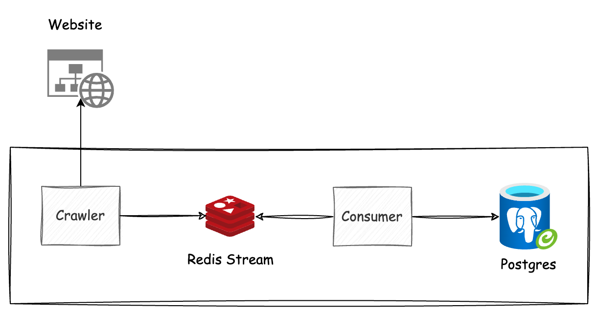
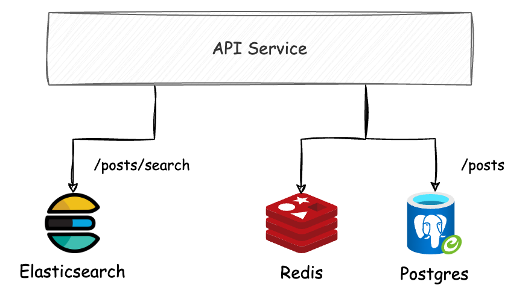

# Crawler Demo for DevOps

In this project, we will set up the CI/CD and infrastructure for the crawler systems below on Kubernetes.

## Overview System

### Crawler System: crawler posts + redis stream + consumer

### Change Data Capture System: Postgres + Kafka Connect + Elasticsearch

### API Service: Rust + Postgres + Elasticsearch

<!-- Crawler: read url writer to Redis -->
<!-- Consumer: sub and receive message from Redis to save to DB -->

# Day 1

## 1 Run Crawler Application

`docker compose up -d`

## 2 Run Database

`cd migrate`

## 3 Run Migration

`go get` \
`go run main.go tables.go init` \
`go run main.go tables.go 25012024_posts.go migrate`

<!-- Errors: check volumes: delete add local and docker -->

## 4 Run Crawler Service

`cd crawler` \
`go run main.go`

<!-- Connect to Redis: use Another Redis -->

## 5 Run Consumer Service

`cd consumer` \
`go run main.go tables.go`

## 6 Dockerize Crawler Service

`docker build . -t crawler-crawler`

## 7 Dockerize Consumer Service

`docker build . -t crawler-consumer`

<!-- Run docker compose for crawler:
docker network create crawler
docker compose -f docker-compose-crawler.yaml up -d
-->

<!-- Docker network: need to declare if using -->

# Day 2

## 1 Run Kafka

`docker compose -f docker-compose-stream.yaml up -d`

<!-- Kafka UI: localhost:8080 -->

## 2 Kafka Connect to connect to postgres

`curl -i -X POST -H "Accept:application/json" -H  "Content-Type:application/json" http://localhost:8083/connectors/ -d @configs/postgres-source.json`

## 3 Create Kafka Connector (on UI)

- Use config on elasticsearch-sink.json

## 4 Run API

`docker compose -f docker-compose-api.yaml up -d`

# Day 3

## Build and push image to docker hub

`docker build . -t nintran52/crawler-app`
`docker push nintran52/crawler-app`
